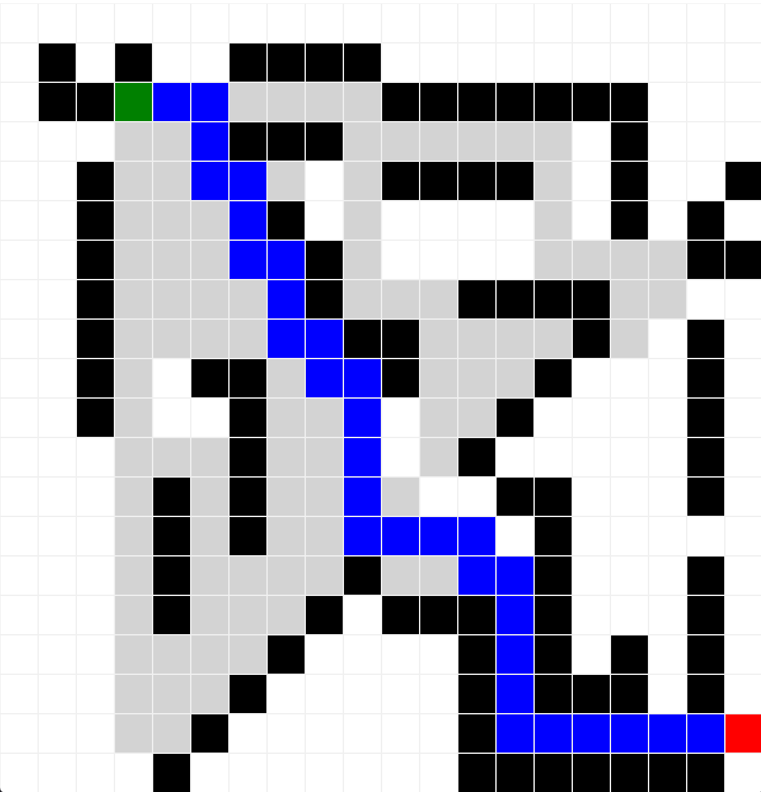

# Simulador do Algoritmo A*

## Descrição
Este projeto é um simulador visual do algoritmo A*, desenvolvido em Python com a interface gráfica Tkinter. O algoritmo A* é utilizado para encontrar o caminho mais curto entre um ponto inicial e um ponto final em um grid, considerando possíveis obstáculos.

## Funcionalidades
- Definição interativa de ponto de início, ponto final e obstáculos no grid.
- Visualização do caminho mais curto calculado pelo algoritmo A*.
- Exibição dos nós explorados durante a busca.

## Como Usar
1. Clone o repositório para sua máquina local.
2. Execute o arquivo principal do projeto (por exemplo, `python main.py`).
3. Interaja com a interface gráfica para definir o ponto de início (clique esquerdo), ponto final (clique direito) e obstáculos (clique do meio ou Ctrl + clique esquerdo).
4. Pressione Enter para iniciar a simulação e visualizar o caminho encontrado.

## Demonstração

## Requisitos
- Python 3.x
- Tkinter (geralmente vem instalado com o Python)

## Contribuições
Contribuições para o projeto são bem-vindas. Se você tem ideias ou sugestões para melhorar o simulador, sinta-se à vontade para criar um pull request ou abrir uma issue.

## Licença
Este projeto é distribuído sob a licença MIT. Veja o arquivo `LICENSE` para mais detalhes.